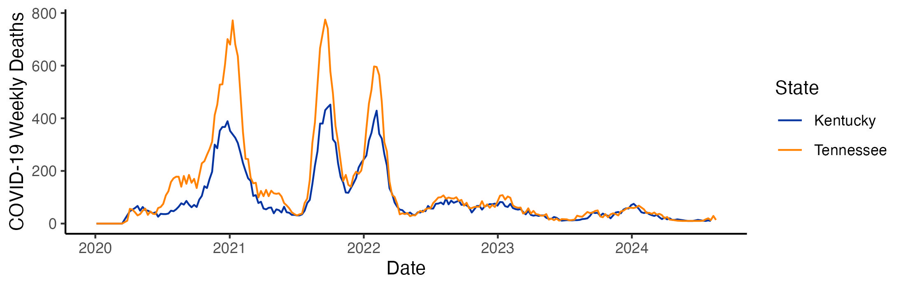

\	

[github site]: https://github.com/vancleve/BIO540-DWV
[canvas site]: https://uk.instructure.com/000000

# Course information

|                    |                                                               |
|--------------------|---------------------------------------------------------------|
| **Instructor**     | Dr. Jeremy Van Cleve                                          |
| **E-mail**         | <jvancleve@uky.edu>                                           |
| **Phone**          | \(859\) 218-3020                                              |
| **Office**         | 216 THM                                                       |
| **Office hours**   | By appointment via e-mail                                     |
|                    |                                                               |
| **Credits**        | 3                                                             |
| **Class Time**     | Tuesday & Thursday 11-12:15pm                                 |
| **Class Location** | JSB 347                                                       |
| **Website**        | <https://github.com/vancleve/BIO540-DWV> (github website)     |
|                    | <https://uk.instructure.com/courses/2122860> (Canvas website) |

# Course description

Biologists working in the laboratory perform many essential biochemical tasks to
prep and run molecular analyses on their specimens and samples. Similarly,
biologists working on data they collected, or on aggregated data collected by
many researchers, must perform essential tasks such as cleaning, reshaping, and
transforming their data so that they can explore and visualize it. The
interdisciplinary field of data science integrates tools from scientific
computing, data visualization, communication, and other fields to help
biologists and other knowledge workers perform these tasks and extract insights
from data.

This three-credit course aims to provide a brief introduction to data science
for biologists and to wrangling, transforming, exploring, and visualizing data
via scripting languages such as R, Python, and Julia. Students will get an
opportunity to wrangle, explore, and visualize datasets from a variety of fields
in biology as well as datasets of their own choosing. Alongside the tools of
data science, the course will also introduce the tools required to document,
maintain, share, and replicate data analyses and visualizations. More broadly,
these tools help constitute the paradigm of “literate programming” and aid in
the production of “reproducible research” wherein replicable and publication
quality research products are generate directly from underlying source files in
one integrated workflow.

# Prerequisites:

- Undergraduate: STA 296, STA 381, PSY 216, or equivalent statistics course.
- Graduate: any undergraduate statistics course.

# Student learning outcomes

At the end of the semester, students will able to:

1.  Execute commands in a scripting language such as R
2.  Load tabular data from a variety of sources including text files, Excel, and databases.
3.  Wrangle and manipulate data by slicing matrices and data tables with Boolean operators and regular expressions
4.  Create visualizations using "grammar of graphics" plotting packages
5.  Visualize multidimensional data grids of plots, networks, and other tools
6.  Use principles of visual perception to design effective graphics
7.  Create [`Quarto`](https://quarto.org/) markdown documents that
    document and explain data exploration and visualization in a reproducible way

# Course format

Each week will consist of a introduction and interactive demonstration of the
concepts and tools for that week on Tuesday followed by interactive problem
solving on Thursday where students apply the concepts and tools from Tuesday.
There may be preliminary readings to do before class for some weeks (see “Topic
schedule” below and check back for updates); please make sure to do those so
that we make the most of time in class.

# Technology requirements

Please bring a laptop to class with a recent version of macOS/Windows/Linux. If
you need to borrow a laptop, please contact the instructor who can help you
obtain one for the semester.

The course will utilize a cloud server for `R`, `RStudio`, and other software
that is hosted by the College of Arts and Sciences.

Access to the server occurs at <https://rstudio.as.uky.edu/>. Once an account
has been created for you by the instructor, you can use you linkblue username and
password to access the server.

# Assessment

|                            |     |                                                                                |
|----------------------------|-----|--------------------------------------------------------------------------------|
| Attendance                 | 20% | Two unexcused absences permitted without penalty                               |
| Lab work                   | 40% | Submitted as markdown file (`.qmd`) before the beginning of the following week |
|                            |     | One unexcused missing lab permitted without penalty                            |
| Data visualization project | 40% | Data analysis and figures using a dataset of your choice                       |
|                            |     | 8-10 min presentation of data and figures                                      |
|                            |     | Markdown document with data analysis and figures due on date of presentation   |

The assessment portion of the course has three components.

1.  **Class attendance**. Two unexcused absences are permitted without penalty.
    Further unexcused absences cannot be made up and will count against class
    attendance according to their fraction of the total class meetings.

2.  Completion of the **lab problems** that we begin in class. This must be
    turned in as a markdown document **before class the following week**. If
    there are datasets that are required for the analysis (*other than datasets
    provided as part of the lab or lecture*), these should be provided along
    with the `Quarto` markdown file (with last name `qmd`) by adding all the
    files to a single compressed `zip` file. The `qmd` or `zip` file should then
    be uploaded to the [Canvas course website][canvas site].
    
3.  **Data visualization project and presentation**. The last two weeks will be
    devoted to 8-10 minute presentations of **five** figures that present data
    from a datasets of your choice. The figures should be “publication quality”
    in terms of aesthetics (labeling, font size, colors, etc) but do not need a
    caption (that’s what the talk is for!). The markdown source code and any
    necessary data files must be submitted to the Canvas website as a `zip`
    file; compiling the markdown file (with `Quarto`) should produce the figures
    as they were presented during the lightning talk. If you want a challenge,
    you can even write your slides in markdown too!
    
    There is a ton of data out there so selecting a dataset can be challenging.
    There a few sites with lots of interesting data that may help get you
    started.
    -  Kaggle. <https://www.kaggle.com/datasets>. Datasets for practicing
       machine
    -  Our World in Data. <https://ourworldindata.org/>. Lots of health,
       demographic, and cultural data from around the world.
    -  Dryad Data Platform. <https://datadryad.org/>. Repository freely reusable
       datasets from scientific publications focusing on ecology and evolution.
    -  Zenodo. <https://zenodo.org/>. Open repository for code and data for
       science with more focus on physical sciences. Search only the datasets
       using [this
       link](https://zenodo.org/search?page=1&size=20&q=resource_type.type:dataset).
    
    Selection of the dataset can be challenging so please do not hesitate to
    consult with the instructor for help.

## Grading scale

| Undergraduate | Graduate |       | Range |     |
|---------------|----------|-------|-------|-----|
| A             | A        | 100%  | to    | 90% |
| B             | B        | < 90% | to    | 80% |
| C             | C        | < 80% | to    | 70% |
| D             | E        | < 70% | to    | 60% |
| E             | E        | < 60% | to    | 0%  |

Midterm grades will be reported to all students by the date specified in Senate Rule 6.1.4.1.

## Graduate students

Graduate students have an additional requirement for the **data visualization
project**. The markdown document containing the data analysis and figures should
be written as a **short** project report with the following sections:

1. Introduction: briefly describe the problem or topic the dataset addresses.
2. Data: describe how the data were originally collected and where or how you
   obtained them.
3. Methods: describe any data wrangling that was necessary before the data could
   be analyzed and visualized.
4. Analyses: add a brief narrative description of each analysis and figure and
   include a statement about what can be concluded from the figure.
5. Conclusion: describe briefly what was learned from the analysis and
   visualization and propose a few next steps.
   
The presentation will constitute **25%** of the course grade and the written
document **15%** of the course grade for a total of **40%** of the course grade
for the data visualization project.

## Tips for making sure everyone, including me, can run your R code.

-   For every assignment, create a separate folder for each assignment and put
    the `.qmd` file and all the other necessary files (data files, images, etc)
    in that folder.
-   Zip the contents of that folder (or the folder itself) and submit that to
    Canvas.
-   Use *relative* directories when pointing to files. Relative directories
    begin simply the name of the file or subdirectory of the current directory
    (I use relative directories in all the course `.qmd` files). That is,
    **avoid** putting in full directories like
    `/home/jva38/class/week1/stuff.jpg` and instead simply put `stuff.jpg` if
    its in the same directory as the `.qmd` file.
-   Make sure your analyses run without errors and your `.qmd` can be compiled
    into a `.html` file successfully.

# Getting help (i.e., uh, how do I…?)

## Classmates and instructor

1.  **Please start a discussion** on the [Canvas website][canvas site]. This will allow
    everyone to benefit from the questions and answers posed. I will monitor
    this discussion and post replies as necessary. Please also post your own
    replies too!
2.  Instructor office hours.

## Internet

1.  Stack Overflow (<http://stackoverflow.com/>). Programming and developer Q&A
    site. Search as normal for keywords, add tags enclosed in square brackets,
    e.g. \[ggplot\] or \[git\], to restrict results to the library or language
    you want answers in.
2.  Cross Validated (<http://stats.stackexchange.com/>). A site in the same
    family as Stack Overflow. Focused on conceptual and procedural questions in
    statistics (less on implementation in R or other languages).
3.  Google. The oldie but the goodie.

# Useful resources

## Books

There are some recent books on data science and visualization (all written in
`RMarkdown`, which is a predecessor and alternative to `Quarto`) that cover much
of the material in the course.

-   Wickham, Hadley, Grolemund, Garrett, and Mine Çetinkaya-Rundel. 2023. R for Data Science (2e). O’Reilly.
    <   https://r4ds.hadley.nz/>
-   Wilke, Claus O. 2018. Fundamentals of Data Visualization.
    <https://clauswilke.com/dataviz/>
-   Healy, Kieran. 2018. Data Visualization: A Practical Introduction.
    <http://socviz.co/>
-   Ismay, Chester and Kim, Albert Y. 2018. An Introduction to Statistical and
    Data Sciences via R. <https://moderndive.com/>
-   Silge, Julia and Robinson, David. 2018. Text Mining with R: A Tidy Approach.
    <https://www.tidytextmining.com/>

If you want to become an R wizard in the style of Hadley Wickham, this book is
for you.

-   Wickham, Hadley. 2019. Advanced R. <https://adv-r.hadley.nz/>

The following are some popular books on R. PDFs are available for “check out” on
the [Canvas website][canvas site] under “Modules:
References”.

-   Chang, Winston. 2013. R Graphics Cookbook. O’Reilly
-   Crawley, Michael J.. 2005. Statistics: An Introduction using R. Wiley
-   Dalgaard, Peter. 2008. Introductory Statistics with R. Springer
-   Gandrud, Christopher. 2015. Reproducible Research with R and R Studio. CRC
    Press.
-   Kolaczyk, Eric D. and Csárdi, Gábor. 2020. Statistical Analysis of Network Data with R (2e). Springer
-   Mailund, Thomas. 2017. Beginning Data Science in R. Apress
-   Murrell, Paul. 2011. R Graphics. CRC Press
-   Phillips, Nathaniel. 2016. YaRrr! The Pirate’s Guide to R.
-   Wickham, Hadley. 2016. ggplot2. Springer
-   Wickham, Hadley and Grolemund, Garrett. 2017. R for Data Science. O’Reilly
-   Wilkinson, Leland. 2005. The Grammar of Graphics. Springer
-   Zelterman, Daniel. 2015. Applied Multivariate Statistics with R. Springer

## Internet

-   Cheatsheets for RStudio and tidyverse packages like `ggplot2` (<https://posit.co/resources/cheatsheets/>).
-   `Quarto` documentation. <https://quarto.org/docs/guide/>
-   FlowingData (<http://flowingdata.com/>). Articles, examples, and tutorials
    on data visualization by Nathan Yau.
-   Other data visualization and wrangling courses:
    -   “Visualizing Data” by Chris Adolph (UWashington):
        <http://faculty.washington.edu/cadolph/index.php?page=22>
    -   STAT 545: “Data wrangling, exploration, and analysis with R” by Jenny Bryan (Posit/RStudio):
        <http://stat545.com/>
    -   Current UBC version of Stat 545:
    -   <https://stat545.stat.ubc.ca/course/>
-   DataCamp interactive courses. <http://www.datacamp.com>

# Topic schedule

The following is the preliminary schedule of topics and will be adjusted
as the semester progress.

| Week | Class Dates   | Topic                                                      | Link                                                      |
|------|---------------|------------------------------------------------------------|-----------------------------------------------------------|
| 1    | 08/27 & 08/29 | Intro to the course and markdown, and Quarto               | [html](https://vancleve.github.io/BIO540-DWV/week01.html) |
| 2    | 09/03 & 09/05 | Intro to R: data types, flow control, and functions        | [html](https://vancleve.github.io/BIO540-DWV/week02.html) |
| 3    | 09/10 & 09/12 | Vectors, slicing, and map(ping)                            | [html](https://vancleve.github.io/BIO540-DWV/week03.html) |
| 4    | 09/17 & 09/19 | Getting data into R data.frames via files and spreadsheets | [html](https://vancleve.github.io/BIO540-DWV/week04.html) |
| 5    | 09/24 & 09/26 | Tidy Data                                                  | [html](https://vancleve.github.io/BIO540-DWV/week05.html) |
| 6    | 10/01 & 11/03 | Joins and databases                                        | [html](https://vancleve.github.io/BIO540-DWV/week06.html) |
| 7    | 10/08 & 10/10 | Text manipulation and regular expressions                  | [html](https://vancleve.github.io/BIO540-DWV/week07.html) |
| 8    | 10/15 & 10/17 | Introduction to plotting and ggplot2                       | [html](https://vancleve.github.io/BIO540-DWV/week08.html) |
| 9    | 10/22 & 10/24 | Plot types in ggplot2                                      | [html](https://vancleve.github.io/BIO540-DWV/week09.html) |
|      | 10/29         | **Fall Break**                                             |                                                           |
| 10   | 10/31         | Principles of displaying data & how to modify plots        |                                                           |
|      | 11/05         | **Election Day**                                           |                                                           |
|      | 11/07         | Principles of displaying data & how to modify plots        |                                                           |
| 11   | 11/12 & 11/14 | Colors and heat maps                                       |                                                           |
| 12   | 11/19         | Visualizing/analyzing lots of data                         |                                                           |
|      | 11/21         | Research data management (UK Data Librarian Isaac Wink)    |                                                           |
| 13   | 11/26         | Networks                                                   |                                                           |
|      | 11/28         | **Thanksgiving Break**                                     |                                                           |
|      | 12/03         | Project presentations                                      |                                                           |
| 14   | 12/05         | Project presentations                                      |                                                           |
|      | 12/10         | **No class - JVC at Conference**                           |                                                           |

# Course policies

## Academic policies 

For full description of UK academic policies regarding excused absences and
their verification, religious observances, prep days and reading days,
accommodations due to disability, and non-discrimination and Title IX
compliance, please see the link below.

<https://provost.uky.edu/proposals/guidance-course-proposals/standard-academic-policy-statements>

## Unexcused absences and late work

Unexcused absences will result in a decrease in the attendance grade and cannot
be made up. Unexcused or late work may be submitted but can be subject to a 5%
penalty per day up to 20%.

## Academic integrity

Per university policy, students shall not plagiarize, cheat, or falsify or
misuse academic records. Students are expected to adhere to University policy on
cheating and plagiarism in all courses.

Please see the link below for the university policies on academic offenses for
official descriptions of cheating and plagarism and the processes and penalties
for violations of the policies.

<https://provost.uky.edu/proposals/guidance-course-proposals/academic-offenses>

## Belonging and engagement

Members of the course are entitled to learn from each other in an open and
welcoming environment regardless of their racial, ethnic, gender, and sexual
identities. Conduct that is not respectful of these identities or of the
national origin, religion, and political beliefs students and instructors will
not be tolerated. Please report any concerning conduct to the instructor.

For information about reporting bias, harassment, or other issues or seeking accommodations, please see
<https://ieeo.uky.edu/contact-us>.

## Face covering/distancing policy

-   Transmission of COVID-19 and other airborne respiratory illnesses is an
    important issue, especially during fall and winter months. The instructor
    and students are entitled to practices that reduce transmission including,
    and not limited to, wearing a high-quality mask and social distancing.

-   These transmission reducing practices are optional but the instructor
    encourages them. If COVID-19 or another airborne illness is a specific risk
    to a student or a student has any concerns about classroom policies, please
    contact the instructor as soon as possible.

## University resources for students

For a list of university resources for students, please see the link below.

<https://studentsuccess.uky.edu/get-help>

## Campus Emergency Response Guide 

See the link below for resources on classroom or campus emergencies.

<https://police.uky.edu/emergency-response-guide>
